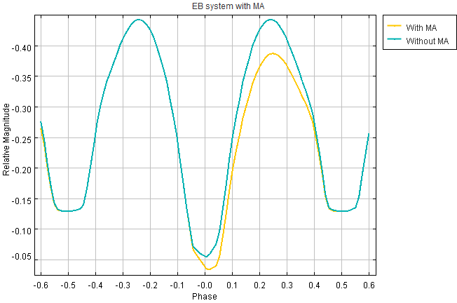

## Outline
- [1-Overview](#1-overview)
  - [1.1-Maxima Asymmetry](#11-maxima-asymmetry)
  - [1.2-Project Goal](#12-project-goal)
- [2-Packages](#2-packages)
- [3-Load and Preprocess Data](#3-load-and-preprocess-data)
  - [3.1 Synthetic data](#31-synthetic-data)
  - [3.2 Load Data](#32-load-data)
  - [3.3 Preprocess Data](#33-preprocess-data)
  - [3.4 Split Data](#34-split-data)
- [4-Define Neural Network Model](#4-define-neural-network-model)
- [5-Model Validation](#5-model-validation)
- [6-Predictions](#6-predictions)
- [7-Results evaluation](#7-results-evaluation)
- [8-What's next](#8-whats-next)

## 1. Overview
### 1.1 Maxima Asymmetry
An EB system consists of two stars orbiting around their common center of mass at a close distance. The phenomenon is periodic, and if the observer's line of sight is closely aligned with the orbital plane of the system (i.e., they form a small angle), one star can eclipse the other, causing a measurable decrease in observed brightness over time. This creates a characteristic light curve, which can be divided into four distinct phases:

- Two maxima: when both stars are visible.
- Two minima: when one star eclipses the other.

In an ideal EB system, the two light maxima are equal. However, in some cases, an asymmetry between the maxima—known as Maxima Asymmetry (MA) or O' Connell effect—is observed. The image below illustrates this, comparing a light curve with MA (blue) and one without MA (yellow).



Many physical mechanisms can cause a MA. One of them is the presence of spot/s, which is an area on the star's surface that has different temperature (emmites different amount of light). There are four parameters that govern the spot.
1. Longitude (degrees)
2. Latitude (degrees)
3. Size (degrees)
4. Temperature ratio

<!-- <figure>
  
  <figcaption>This is the caption.</figcaption>
</figure>-->
<!--|  |  |
|----------------|----------------|-->

### 1.2 Project Goal

The goal of this project is to develop a neural network (NN) capable of estimating the star spot parameters that could explain the observed MA in a given EB system. The key idea is to train the NN on synthetic light curve data to learn the inverse problem—inferring physical spot characteristics from the shape of the curve.


## 2. Packages

The packages used for this project are
- Tensorflow and Keras
- Numpy
- Matplotlib
- Sklearn (scikit-learn)

```python
import numpy as np
import tensorflow as tf
import matplotlib.pyplot as plt
from tensorflow.keras import Sequential
from tensorflow.keras.layers import Dense, Lambda
from tensorflow.keras.activations import relu
from tensorflow.keras.optimizers import Adam
from sklearn.preprocessing import StandardScaler
from sklearn.model_selection import train_test_split
from scipy.interpolate import PchipInterpolator
from scipy.interpolate import Akima1DInterpolator
```

## 3. Load and Preprocess Data
### 3.1 Synthetic data
Since real observational data does not include ground truth for star spot parameters, I generated synthetic data using [PHOEBE](https://phoebe-project.org/) (PHysics Of Eclipsing BinariEs). I employed Monte Carlo sampling to create 10,000 synthetic light curves for a specific eclipsing binary system. Each light curve was standardized to 201 equally spaced phase points.

All other physical parameters of the EB system were held constant at values known from independent studies. For simplicity, the synthetic light curves were simulated in the Johnson B filter of the photometric UBV system.

### 3.2 Load Data
Load light curve data (synthetic_lc.dat) and corresponding spot parameters (spot_par.dat).
- x_t contains the light curve magnitudes.
- y_t contains 4 target spot parameters.

```python
synthetic_lc = np.loadtxt('synthetic_lc.dat')
spots_par = np.loadtxt('spot_par.dat')
```

Reshape and normalize the light curves:
```pyhton
x_t = synthetic_lc[:,2]
x_t = x_t.reshape(n_sample, -1)
```
### 3.3 Preprocess Data
Each sample's feature values (i.e., light curve fluxes) are normalized using Z-score normalization, where the mean and standard deviation are computed across the dataset. Different scaling strategies are applied to the target (spot) parameters:

Min-Max scaling is used for the first three parameters:

- Longitude
- Latitude
- Size

Z-score normalization is used for the fourth parameter:
- Temperature Ratio

This approach ensures that both input and target data are well-conditioned for neural network training.
```python
scale_par_1 = [] # mean or max
scale_par_2 = [] # std or min
```
Save scaling parameters for potential inverse transformations later:
```python
np.save('scale_par_1.npy', scale_par_1)
np.save('scale_par_2.npy', scale_par_2)
```

### 3.4 Split Data
The dataset is divided into three subsets using train_test_split from scikit-learn:
- Training Set – Used to train the neural network.
- Cross-Validation Set – Used for model tuning and to prevent overfitting.
- Test Set – Used for final evaluation of model performance on unseen data.
This structured split ensures robust model training and unbiased performance assessment.

```python
x_train, x_, y_train, y_ = train_test_split(x_t, y_t, test_size=0.40, random_state=1)
x_cv, x_test, y_cv, y_test = train_test_split(x_, y_, test_size=0.50, random_state=1)
```

## 4. Define Neural Network Model
A simple feedforward network with 4 hidden layers:
- Three hidden layers (256, 128 and 64 units) – Fully connected layers with ReLU activation
- Output layer (4 units) - sigmoid activation, representing the predicted spot parameters (scaled)

| Layer (type) | Output Shape     | Activation | Parameters |
|--------------|------------------|------------|------------|
| Input        | (None, features) | —          | 0          |
| Dense        | (None, 256)      | ReLU       | —          |
| Dense        | (None, 128)      | ReLU       | —          |
| Dense        | (None, 64)       | ReLU       | —          |
| Dense        | (None, 4)        | Sigmoid    | —          |

```Python
model = Sequential([
    tf.keras.Input(shape=(features,)),
    Dense(256, activation="relu"),
    Dense(128, activation="relu"),
    Dense(64, activation="relu"),
    Dense(4, activation="sigmoid"),
])
```
The model is compiled using the Adam optimizer with a learning rate of 0.001, and mean squared error (MSE) as the loss function:

```python
model.compile(optimizer=Adam(learning_rate=0.001), loss='mean_squared_error')
```
Train the model for 500 epochs while tracking validation and test loss:
```python
history = model.fit(
   	x_train, y_train,
   	validation_data = (x_cv, y_cv),
   	epochs=500,
    callbacks=[test_loss_callback]
)
```
A custom Keras callback is used to evaluate the test loss at the end of each epoch:
```python
class TestLossCallback(tf.keras.callbacks.Callback):
    ...
```

## 5. Model validation
Visualize training, validation, and test loss:
```python
plt.plot(history.history['loss'], label='Training Loss')
plt.plot(history.history['val_loss'], label='Validation Loss')
plt.plot(test_losses, label='Test Loss')
```
The following image shows the loss and the accuracy of the NN during training. Although the model exhibits slight overfitting (as indicated by the validation loss being higher than the training loss), the test loss remains close to the training loss, suggesting that the model generalizes well to unseen data.
This is further supported by the accuracy vs. epoch plot, where the training, validation, and test accuracies converge around 0.750, indicating consistent performance across all three datasets. (0.75[^1]).


[^1]: While an accuracy of 0.75 may seem relatively modest, it is considered acceptable given the complexity of the problem and the high degree of correlation between the physical parameters of the eclipsing binary system and the star spot characteristics.

## 6. Predictions
Finally, the trained model is applied to the observational light curve of the target eclipsing binary system to infer the corresponding star spot parameters. However, this step requires additional preprocessing, as the implementation is not entirely straightforward:

1. Phase Folding:
The observational data are not initially in phase. To correct this, phase folding is performed using the known orbital period and epoch of the system.

2. Interpolation:
Each synthetic light curve in the training set consists of 201 equally spaced phase points. Since the observational data are irregularly sampled, they are interpolated to match the same 201-point grid for consistency with the training data.

3. Normalization:
The interpolated observational light curve is then normalized using the same Z-score method applied to the training features, ensuring compatibility with the model's expectations.

Once these steps are complete, the processed light curve is passed through the neural network to predict the star spot parameters. The figure below shows the result of interpolating the observed data to 201 equally spaced phase points.


## 7. Results evaluation
To evaluate the predictions made by the the NN for the four star spots parameters I update the physical model of the system, using PHOEBE to include a star spot on the surface of the hotter star of the EB system. This update had two noticeable effects:

1. A slight decrease in the $χ^2$ of the model fit.,
2. The model still fails to accurately reproduce the first light curve maximum.
   
The first result indicates that the trained model can infer physically plausible spot parameters and improve the fit to the observational data. However, the second result highlights that there is still room for improvement—particularly in reproducing finer details of the light curve asymmetry.

As shown in the figure above, the model with the spot ($χ^2 = 1.490$) performs slightly better than the model without the spot ($χ^2 = 1.557$).


## 8. What's next
To further improve the model and its predictive performance, several enhancements could be explored:

1. Increase the Size of the Synthetic Dataset
Generating more synthetic light curves could help the model better generalize, improving both training and validation accuracy.

2. Train for More Epochs
Extending the number of training epochs may lead to better convergence. It would be useful to monitor how the model’s performance evolves and whether overfitting increases.

3. Extend the Model to Multiple Photometric Filters
Expand the neural network to incorporate synthetic and observational data from additional filters—specifically Johnson’s V and Cousins’ R and I. This would provide a more complete view of the system’s light emission and improve model robustness.

4. Re-evaluate Spot Placement
Currently, the star spot is placed on the hotter star. An alternative approach would be to place the spot on the cooler star, which might yield a better fit to the observed light curve asymmetry.

5. Refine Uncertain Physical Parameters
Explore the effect of adjusting system parameters that are not precisely known (e.g., system Temperature). Fine-tuning these values may improve the physical model and, consequently, the accuracy of the neural network's predictions.
