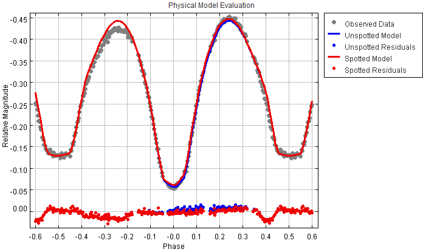
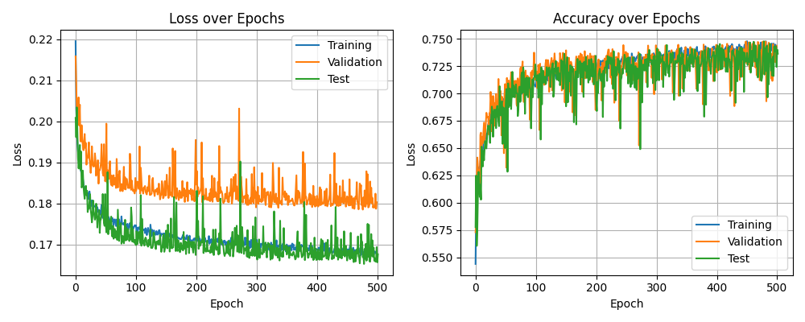
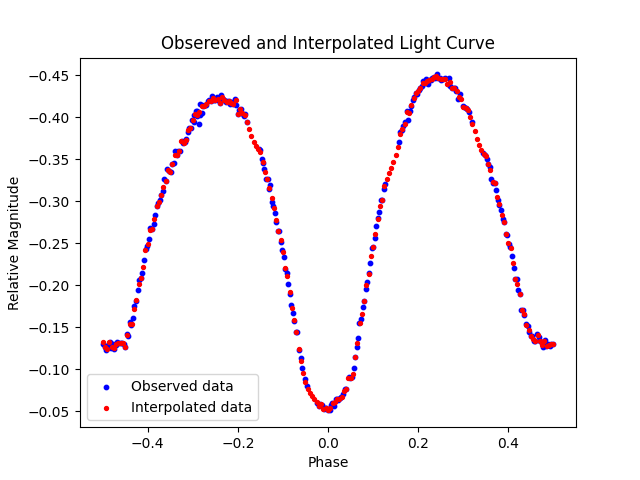

## Overview
This project implements a neural network to predict the values of star spot parameters of an eclipsing binary star system (EB system).
An EB system consists of two stars in a very small distance, orbiting around their common center of mass. The phenomenon is periodical and under certain circumstances the two star can eclipse one the other causing a decrease of light observed in time.
Consequently the light curve of EB's can be devided in four different parts. Two parts that we observe the maximum light (both stars visible) and two parts that we observe minimum light (eclipses). 
I general the two maximum of light observed in the curves should be equal. Whenever this is not the case, a maxima asymmetry (MA) is present.

Many physical mechanisms can cause a MA. One of them is the presence of spot/s, which is an area on the star's surface that has different temperature (emmites different amount of light). There are four parameters that govern the spot.
1. Longitude
2. Latitude
3. Size
4. Temperature ratio

<p float="left">
  
  
</p>

The purpose of the present is to implement a neural network to search for a set of spot parameters values that could account for the MA observed in the EB system at hand. 

## Outline
- [1-Packages](#1-packages)
- [2-Load and Preprocess Data](#2-load-and-preprocess-data)
  - [2.1 Synthetic data](#2.1-synthetic-data)
  - [2.2 Load Data](#2.2-load-data)
  - [2.3 Preprocess Data](#2.3-preprocess-data)
  - [2.4 Split Data](#2.4-split-data)
- [3-Define Neural Network Model](#3-define-neural-network-model)
- [4-Model Validation](#4-model-validation)
- [5-Predictions](#5-predictions)
- [6-Results evaluation](6-results-evaluation)


## 1. Packages

The packages used for this project are
- Tensorflow and Keras
- Numpy
- Matplotlib
- Sklearn (scikit-learn)

```python
import numpy as np
import tensorflow as tf
import matplotlib.pyplot as plt
from tensorflow.keras import Sequential
from tensorflow.keras.layers import Dense, Lambda
from tensorflow.keras.activations import relu
from tensorflow.keras.optimizers import Adam
from sklearn.preprocessing import StandardScaler
from sklearn.model_selection import train_test_split
from scipy.interpolate import PchipInterpolator
from scipy.interpolate import Akima1DInterpolator
```

## 2. Load and Preprocess Data
### 2.1 Synthetic data

Since real data doesn't include ground truth for star spots parameters, I generated synthetic data using [PHOEBE](https://phoebe-project.org/)(PHysics Of Eclipsing BinariEs). I used Monte-Carlo sampling to generate 10,000 light curves for a specific eclipsing binary system, stadarized them to 201 equaly spaced phase points.
All other physical parameters of the EB system were kept fixed in values that are known by other means.

### 2.2 Load Data
Load light curve data (synthetic_lc.dat) and corresponding spot parameters (spot_par.dat).
- x_t contains the light curve magnitudes.
- y_t contains 4 target spot parameters.

```python
synthetic_lc = np.loadtxt('synthetic_lc.dat')
spots_par = np.loadtxt('spot_par.dat')
```

Reshape and normalize the light curves:
```pyhton
x_t = synthetic_lc[:,2]
x_t = x_t.reshape(n_sample, -1)
```
### 2.3 Preprocess Data
Normalize each sample features values, using Z-score normalization (mean and standard deviation).
Different scaling methods are used for target parameters:
- For the first 3 parameters: Min-Max scaling
- For the last parameter: Standard (Z-score) scaling
```python
scale_par_1 = [] # mean or max
scale_par_2 = [] # std or min
```
Save scaling parameters for potential inverse transformations later:
```python
np.save('scale_par_1.npy', scale_par_1)
np.save('scale_par_2.npy', scale_par_2)
```

### 2.4 Split Data
Split the dataset into:
- Training set
- Cross-validation set
- Test set
Using train_test_split
```python
x_train, x_, y_train, y_ = train_test_split(x_t, y_t, test_size=0.40, random_state=1)
x_cv, x_test, y_cv, y_test = train_test_split(x_, y_, test_size=0.50, random_state=1)
```

## 3. Define Neural Network Model
A simple feedforward network with 4 hidden layers:
- 3 ReLU hidden layers (256, 128 and 64 units)
- 1 output layer with 4 units and a sigmoid activation

| Layer (type) | Output Shape     | Activation | Parameters |
|--------------|------------------|------------|------------|
| Input        | (None, features) | —          | 0          |
| Dense        | (None, 256)      | ReLU       | —          |
| Dense        | (None, 128)      | ReLU       | —          |
| Dense        | (None, 64)       | ReLU       | —          |
| Dense        | (None, 4)        | Sigmoid    | —          |

```Python
model = Sequential([
    tf.keras.Input(shape=(features,)),
    Dense(256, activation="relu"),
    Dense(128, activation="relu"),
    Dense(64, activation="relu"),
    Dense(4, activation="sigmoid"),
])
```
Compile with the Adam optimizer and mean squared error loss.
```python
model.compile(optimizer=Adam(learning_rate=0.001), loss='mean_squared_error')
```
Train the model using 500 epochs, with validation and test loss tracked:
```python
history = model.fit(
   	x_train, y_train,
   	validation_data = (x_cv, y_cv),
   	epochs=500,
    callbacks=[test_loss_callback]
)
```
Define a custom Keras callback to evaluate the test loss at the end of each epoch:
```python
class TestLossCallback(tf.keras.callbacks.Callback):
    ...
```
## 4. Model validation
Visualize training, validation, and test loss:
```python
plt.plot(history.history['loss'], label='Training Loss')
plt.plot(history.history['val_loss'], label='Validation Loss')
plt.plot(test_losses, label='Test Loss')
```


## 5. Predictions
Finally, I apply the trained model to the observational light curve of the target system to infer the optimized star spot parameters.

The implementation is not entirely straightforward and requires some additional data processing. As mentioned earlier, each synthetic light curve consists of 201 equally spaced phase points. However, the observational data do not follow a fixed, evenly spaced grid. Therefore, I interpolate the observational light curve to match the same resolution before feeding it into the model.

Further, the observational data are not in phase, so phase folding is implemented using the system's known period and epoch.

Finally, I scaled the observational data before feed them to the model.


Picture a shows the interpolation of observational data


## 6. Results evaluation
To evaluate the predictions made by the the NN for the four star spots parameters I update, in PHOEBE, the physical model of the system to include a star spot on the surface of star 1. This has two effects:

1. a small decrease of the χ^2 value,
2. a the model still cannot represent correctly the first maximum of light.
The first effect shows that the trained model not only can infere physeable results but it also increase the accuracy of the fitted model. While, the second one shows that there still room for improvment.


## 7. What's next
To inprove my model I could do one of the following:
1. Increase number of synthetic data to improve both training and validation accuracy.
2. Increase the number of epochs and examine the effect that it has on the model.
3. Create a more complete NN model to include synthetic and observation data for the other 3 filters.
4. Try a different approch on the system's physical model by removing the star spot from star 1 and put it on star 2 of the system.
5. Try different values for physical parameters of the system that are ambigues.
